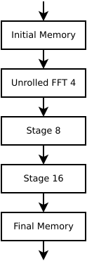
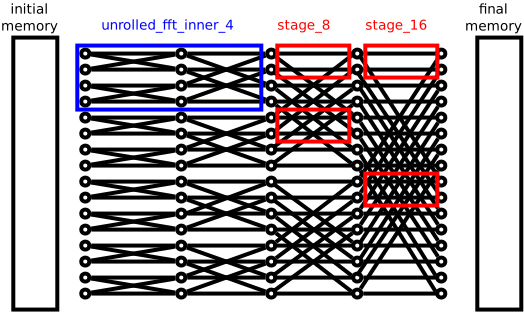

# High Throughput FFT Implementation

An implementation designed to work for large FFT sizes, high clock frequencies,
and with multiple samples consumed every clock cycle.
**This is a work in progress, and is not yet functional.**

Several of the VHDL entities, including the top-level entity are generated.  The
parameters for the top-level generator are:

- **N**: The number of samples in a FFT.  Must be a power of two.
- **SPCC**: The number of samples consumed every clock cycle.  Must be at least 2 and a power of two.
- **INPUT_WIDTH**: The bit-width of an input sample.
- **TWIDDLE_WIDTH**: The bit-width of a twiddle factor.
- **SUFFIX**: A suffix appended to the generated entity names.

Generation is done using Jinja2 templates and Fusesoc generators.  Testing is done using cocotb.
An fully unrolled FFT for when N=SPCC was created as part of the HTFFT, but can also be
used independently.

To do
-----
* [x] Butterfly
* [x] Unrolled FFT
* [x] FFT Stage
* [ ] Initial memory
* [ ] Final memory
* [ ] Top level
* [ ] Documentation
* [ ] Improve testing
* [ ] Investigate rounding and precision

Architecture
------------

The architecture of the HTFFT is split into four main components:
 - **Initial Memory** takes care of reordering the input vector.
 - **Unrolled FFT** performs SPCC-input FFTs on the input vectors.
   Because SPCC samples arrive every clock cycle, this module does
   not need any memory beyond the flipflops requried for pipelining.
 - **FFT Stages** are used for the subsequent stages of the FFT.
   These consume their inputs over multiple clock cycles and so require
   memories to store their inputs and peform reordering.
 - **Final Memory** takes care of reordering the output vector.
 
The diagram below shows a top level architecture for a 16-point FFT
that consumes 4 samples every clock cycle.

The following diagram shows how those hardware blocks would operate
on the FFT structure.  It doesn't take into account pipelining at all
so isn't realistic.

Top-level HTFFT Ports
---------------------
- **clk**: Clock, rising edge active.
- **i_first**: Indicates that this is the first clock cycle of an input vector.
- **i_data**: INPUT_WIDTH*SPCC bit-wide input data.  Contains SPCC complex samples.
- **o_first**: Indicates that this is the first clock cycle of an output vector.
- **o_data**: OUTPUT_WIDTH*SPCC bit-widt output data. Contains SPCC complex samples.

The OUTPUT_WIDTH of a complex sample is the INPUT_WIDTH + logceil(N)*2.

For a complex sample with width=WIDTH, the upper WIDTH/2 bits are the
signed real component, and the lower WIDTH/2 bits are the signed
imaginary component. To keep things simple, if INPUT_WIDTH=8, then a
signed value of 0100 would map to 1.0 and a signed value of 1100 would
map to -1.0. The absolute value of all input samples is required to be
less than or equal to 1.0.

Modules
-------

- HFFT
  * A high throughput FFT implementation.
  * Work in progress.
  * Initial memory and final memory are unimplemented.
 
- unrolled_fft
  * An unrolled FFT implementation for when N = SIZE.
  * Working but needs work to investigate rounding and optimum precision
    at different stages.  Probably still buggy.
   
- unrolled_fft_inner
  * An internal module of the unrolled_fft. Includes everything except
    for the initial reordering. Used in both the HTFFT and the
    unrolled_fft implementations.

- comb_reordering
  * Combinatorial reordering to use with unrolled_fft_inner to make
    unrolled_fft.
   
- stage
  * A stage in a FFT where SIZE < N.  Used interally in the HTFFT.
  * Mostly working but poorly tested.  Has issues with rounding an precision.
  * More [Stage Docs](/docs/stage.md)
 
- butterfly
  * A FFT butterfly module.  Used by 'stage' and 'unrolled_fft_inner'.

- mult
  * A multiplier implementation.  Used in butterfly module.
 
- memory
  * A basic memory implementation. Used in various places.
 
- shift_register
  * A basic shift_register implementation. Used in various places.
 
- htfft_pkg
  * A package with utility functions.
 
- initial_memory
  * Does the initial reordering in the HTFFT.
    Work in progress
   
- barrel_shifter
  * A barrel shifter implementation.  Used in the initial_memory. Unimplemented.

- final_memory
  * Does the final reordering in the HTFFT.  Unimplemented.
