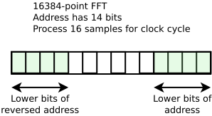
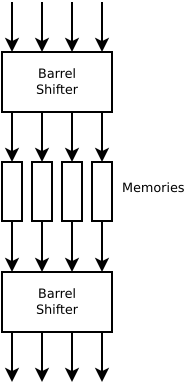

# Initial Memory

The purpose of the initial memory is to reorder the samples from the
order in which they arrive to the order in which they are required by
the unrolled FFT module.

For an N-point FFT each point can be given a logceil(N)-bit address.
The address is defined so that it counts the order in which they are
received, where if SPCC samples arrive each clock cycle, then the
upper logceil(N/SPCC) bits represent the clock cycle on which they
arrive, and the lower logceil(SPCC) bits give the position within the
bus.

The unrolled FFT requires the samples to arrive in the order given by
the bit-reversed version of the same address. Because the SPCC samples
that arrive together, which not be grouped together during output we
need SPCC independent memories so that we can regroup the samples
appropriately.

The first step is to find a mapping from the address to a memory
index. The constraints on this memory mapping are:

 - The address and the reversed address should map to the same memory_index.
 - SPCC samples that are all input together or all output together must be located
   in SPCC different memories.
   
A nice solution to these constraints is to consider the logceil(SPCC)
lower bits in the address and the logceil(SPCC) upper bits in the
address. If we convert both of these to integers (with the upper bits
having their LSB to the left, and the lower bits having their LSB to
the right) and then add them together modulo SPCC then we get a value
that works well as the memory_index. This method is nice between it is
symmetric to address reversal, and the mapping into and out of the
memories can be done with barrel shifters which will be much cheaper
than general muxes when SPCC is large.  This method will work nicely
when 2*logceil(SPCC) <= logceil(N).  I'm not sure yet whether it will
work when this is not true, since the two logceil(SPCC) sets of bits
will overlap which probably messes up the barrel-shifting properties.

The value that we use for address within the memory can just be taken
to be the upper logceil(N/SPCC) bits of the address.

It will also make sense to write the data's into the memories for the
first FFT using the standard addresses and read using the reversed
addresses, but then for the next FFT write the memories in using the
reversed addresses and read using the standard addresses.  The advantage
of this is that we'll be able to use half as much memory since we'll be
writing into the addresses that we've just read from.

The architecture of the initial memory will end up looking like:

